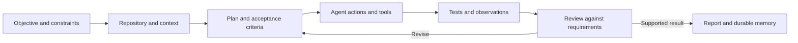

# Aurelian

**Context, execution, and evidence standards for AI agent workflows.**

Aurelian is a project by Andrian Kolliegbo for making longer-running agent work easier to direct, inspect, and evaluate. It gives coding and research agents a shared procedure for understanding a task, loading relevant context, planning changes, using tools, checking results, and preserving what the next session needs to know.

The central question is practical: **when an agent says a task is complete, what evidence supports that claim?** A plausible final answer can hide a misunderstood requirement, a stale test result, a failed tool call, or a mistake passed between stages. Aurelian makes those intermediate steps part of the workflow.

[Get started](#get-started) · [Architecture](docs/ARCHITECTURE.md) · [Workflow examples](docs/WORKFLOWS.md) · [Reliability and research](docs/RELIABILITY.md) · [Full index](INDEX.md)

## What is in this repository?

This repository contains the **Markdown instruction framework**: operating rules, agent adapters, project templates, research and review procedures, and evaluation protocols. Use it with an agent environment that supplies the model, repository access, tools, and execution permissions.

Related Aurelian development includes a separate Python Runtime and Trust Core for persistent execution and evidence-based completion. Their source code and packages are **not included in this repository**. The [architecture guide](docs/ARCHITECTURE.md) explains the relationship and the distinction between written guidance and executable enforcement.

## How the workflow fits together



Instructions establish expectations; the host environment and project tooling determine which rules can be enforced automatically.

| Concern | Repository support |
|---|---|
| Context and continuity | [Memory rules](core/04_MEMORY_SYSTEM.md), project state, decisions, and context templates |
| Planning and tool use | [Task procedures](core/03_EXECUTION_ENGINE.md), [decision rules](core/07_DECISION_ENGINE.md), scoped prompts |
| Verification and completion | [Proof standards](core/08_VERIFICATION_ENGINE.md), evidence logs, acceptance criteria |
| Independent review | [Specialist review protocol](skills/22_REVIEW_SWARM.md) with evidence-backed findings |
| Research and uncertainty | [Scientific reasoning](core/12_SCIENTIFIC_REASONING.md), source-backed research workflows |
| Provenance | [Traceability contract](core/14_TRACEABILITY_ENGINE.md) linking requirements, changes, tests, and reviews |
| Evaluation | [Comparison protocol](evaluation/17_EVALUATION_PROTOCOL.md) and [benchmark guidance](evaluation/19_BENCHMARK_PROTOCOL.md) |

## Models, tools, and data

Aurelian has been used in workflows with Claude through Claude Code and OpenAI models through Codex. This repository also provides [adapter guidance](adapters/) for other environments. An adapter documents a mapping; it does not establish that every model or tool combination has been tested.

The host agent can work with file reading and editing, code search, terminal commands, Git, test runners, and research tools where available. Aurelian does not bundle a model, API credentials, or an MCP server.

Typical inputs are task specifications, source code, documentation, Git state, and scientific or technical sources. Outputs include code changes, reports, test logs, decisions, and execution evidence. The repository does not distribute a model-training dataset or trained model weights.

## Get started

For a small task, give the agent the [Constitution](core/01_CONSTITUTION.md) and the project's actual requirements and verification commands.

For an existing project:

1. Follow [Install Aurelian in a project](INSTALL_AURELIAN_IN_PROJECT.md).
2. Merge the relevant [project loader](templates/aurelian-project/) into existing instructions. Preserve project-specific rules.
3. Make the five standard kernel files in the [load order](INDEX.md#load-order) available to the agent. If Aurelian lives outside the target project, use its actual location.
4. Fill in the objective, constraints, current state, and acceptance criteria. Keep unknown facts explicit.
5. Run a bounded task using the prompt below, then inspect the resulting diff and evidence.

```text
Read the project's agent instructions and the standard Aurelian kernel.
Objective: [the concrete change or question]
Relevant context: [files, requirements, prior decisions]
Scope and constraints: [what may change and what must be preserved]
Acceptance criteria: [observable conditions for success]
Verification: [the project's real commands and required observations]

Inspect the current state before planning. Perform the scoped work, check it
against the acceptance criteria, and review the diff. Report the evidence,
remaining uncertainty, and any blocker. Update durable memory only where it
will change the next session's decisions.
```

The [workflow examples](docs/WORKFLOWS.md) show how to apply this to engineering, review, and literature research.

## Reliability and research direction

Aurelian explores how failures enter agent workflows and how evidence can make those failures easier to diagnose. The [reliability guide](docs/RELIABILITY.md) covers concrete development cases, including recovery tests that accepted empty outcomes and an upstream data-label mismatch that affected downstream verification.

These cases motivate questions about failure propagation, context selection, evidence freshness, and controlled interventions. They are not a benchmark showing that Aurelian improves every agent. The repository includes protocols for evaluating that hypothesis.

## Navigate the project

| Path | Contents |
|---|---|
| [Architecture](docs/ARCHITECTURE.md), [workflows](docs/WORKFLOWS.md), [reliability](docs/RELIABILITY.md) | Project explanation and concrete examples |
| [core/](core/) | Reasoning, memory, execution, traceability, and evaluation rules |
| [skills/](skills/) and [playbooks/](playbooks/) | Procedures for specific tasks and broader project workflows |
| [prompts/](prompts/) | Bootstrap and task prompts |
| [adapters/](adapters/) | Mappings to agent environments |
| [templates/aurelian-project/](templates/aurelian-project/) | Project loaders, context, evidence logs, and report structure |
| [examples/](examples/README.md) | Worked planning, debugging, review, and refactoring examples |
| [evaluation/](evaluation/) | Evaluation protocols and scorecards |
| [self-improvement/](self-improvement/16_SELF_IMPROVEMENT.md) | Revising the framework from observed failures |

See [INDEX.md](INDEX.md) for the complete file map and [CHANGELOG.md](CHANGELOG.md) for recorded changes.

## Project history and license

Aurelian originated from the Legacy Fable research initiative. Its current focus is transferable engineering procedures for tool-using agents.

The repository currently uses an [all-rights-reserved notice](LICENSE.md); no open-source license has been selected.
