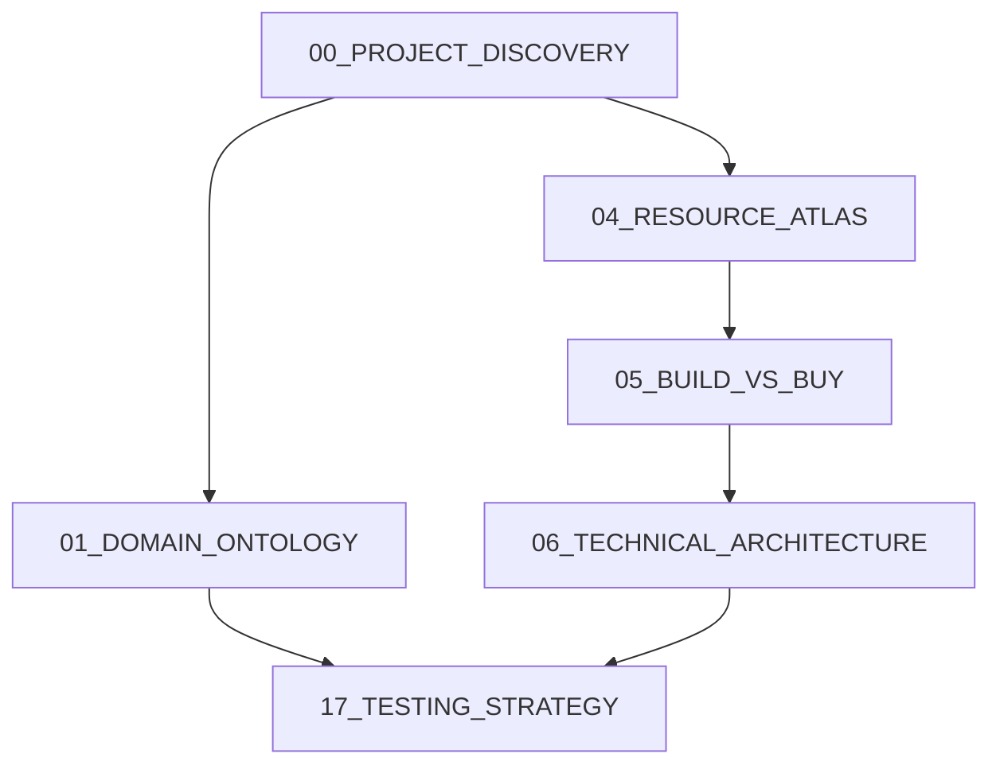

# 23_RESEARCH_PIPELINE_GENERATOR -- Decide What Must Be Researched Before Building

## Purpose

Generate a complete, ordered research pipeline from a project idea, an existing repository, or both. The skill determines which domains need research, which reports should exist, who should produce them, how the reports depend on each other, and whether discovery must happen before research can be scoped responsibly.

This skill is the planning layer before `../playbooks/18_RESEARCH_TO_EXECUTION_OS.md`: it decides the research suite that the research-to-execution workflow will execute.

## Trigger

Use this skill when:

1. Starting a new product, feature, tool, integration, architecture, AI workflow, UI/editor system, migration, or unfamiliar-domain project.
2. The user gives only a project idea and asks what should be researched before implementation.
3. The user gives a repository and asks what research, audits, or discovery should happen before changes begin.
4. The project touches regulated, scientific, security-sensitive, privacy-sensitive, model-dependent, infrastructure-heavy, performance-sensitive, or user-facing domains.
5. Existing research docs are missing, stale, incomplete, or not clearly connected to implementation decisions.

Do not use this skill as a substitute for doing the research. It produces the research pipeline, prompts, dependency graph, and execution order.

## Inputs

Accept any combination of:

- Project idea, product brief, ticket, roadmap item, or user story.
- Existing repository, docs, issue tracker, architecture notes, research folder, ADRs, designs, screenshots, or data samples.
- Constraints: stack, budget, timeline, deployment target, compliance, audience, quality bar, non-goals, autonomy level.
- Available tools: repo access, web research, design tools, browser, databases, test runners, domain experts, subagents.

If the only input is a short project idea, generate a pipeline with lower confidence and mark discovery needs explicitly.

## Research Categories

Classify needed research using this taxonomy. Include only categories that affect implementation decisions, but consider each category before skipping it.

| Category | Use when |
|---|---|
| Domain knowledge | The problem space has specialized concepts, workflows, units, authorities, or failure modes. |
| Technical architecture | System boundaries, data flow, state, scaling, reliability, or reversibility are uncertain. |
| Frontend | Client framework, rendering model, component architecture, browser constraints, or UI state is material. |
| Backend | APIs, services, persistence, queues, jobs, auth, concurrency, or integrations are material. |
| AI/ML | Models, prompts, evals, embeddings, agents, datasets, cost, latency, or hallucination risk are material. |
| UX | User goals, flows, task success, information architecture, errors, onboarding, or recovery are uncertain. |
| UI | Visual system, layout, components, theming, design tokens, or implementation primitives matter. |
| Motion | Animation, gestures, transitions, interruption, reduced motion, or editor/canvas interaction matters. |
| Accessibility | Keyboard, semantics, screen reader, contrast, reduced motion, or assistive tech requirements matter. |
| Infrastructure | Hosting, networking, storage, observability, environments, secrets, or operational topology matter. |
| DevOps | CI/CD, release, rollback, preview environments, migrations, incident response, or deployment flow matter. |
| Testing | Test strategy, fixtures, evals, visual checks, integration seams, or quality gates are uncertain. |
| Security | Trust boundaries, auth/authz, sandboxing, injection, secrets, abuse, supply chain, or generated code matter. |
| Product strategy | Audience, positioning, scope, monetization, roadmap, value proposition, or success metrics are uncertain. |
| Competitive analysis | Existing products, alternatives, benchmarks, pricing, differentiation, or category conventions matter. |
| Legal/privacy | Personal data, licensing, compliance, terms, copyright, retention, consent, or jurisdiction matters. |
| Performance | Latency, throughput, frame budget, bundle size, cost, scalability, or resource ceilings matter. |
| Scientific validation | Claims require empirical evidence, methodology, measurement validity, or domain correctness. |
| Datasets | Training/eval data, schemas, provenance, quality, labeling, rights, representativeness, or drift matter. |
| APIs | Third-party APIs, SDKs, rate limits, auth, webhooks, SLAs, current docs, or integration risk matter. |
| Open-source ecosystem | Libraries, frameworks, examples, maintainers, licenses, maturity, and alternatives must be compared. |
| Resource atlas | Durable catalog of reusable internal/external resources is needed to avoid repeated discovery. |
| Build-vs-buy | The project may be better served by wrapping, buying, adapting, or avoiding an existing solution. |

## Algorithm

1. **State the implementation decision.** Name what the project is trying to build or change, who it serves, and what implementation would be blocked by missing knowledge.
2. **Inspect local evidence when available.** Search for existing docs, ADRs, research folders, resource atlases, package manifests, designs, tests, security notes, and prior decisions. If no repo is available, mark repo-derived claims as unavailable.
3. **Separate discovery from research.** Discovery maps what exists; research answers what is unknown. If the project/repo shape is unclear, require a discovery report first.
4. **Score each category.** For every category in the taxonomy, assign: needed | optional | skip. Record the reason, confidence, and implementation impact.
5. **Generate report candidates.** For each needed category, create one or more research documents only where the output feeds a concrete implementation decision.
6. **Merge overlaps.** Combine reports whose sources, specialists, and downstream decisions are the same. Split reports when different specialists, evidence standards, or dependency order are required.
7. **Assign specialists.** Choose the smallest set of roles that can answer the questions: domain researcher, architect, frontend engineer, backend engineer, AI/ML engineer, UX researcher, UI/taste reviewer, motion designer, accessibility specialist, infra/DevOps engineer, test strategist, security reviewer, product strategist, competitive researcher, legal/privacy reviewer, performance engineer, data scientist, API integration specialist, OSS/resource researcher.
8. **Map dependencies.** Mark reports that require discovery, resource atlas, domain ontology, architecture constraints, API docs, dataset inventory, UX workflow research, or security threat model before they can be useful.
9. **Estimate confidence and impact.** Confidence reflects evidence available for recommending the report; implementation impact reflects how much the report can change build decisions.
10. **Order execution.** Put prerequisite discovery and high-decision-value research first. Prefer reports that retire irreversible, security, legal, data, architecture, or build-vs-buy risk early.
11. **Define completion criteria.** Every report must state required inputs, expected outputs, downstream dependencies, estimated effort, and what would make the report sufficient for implementation planning.
12. **Emit graph and order.** Produce both a dependency graph and an ordered execution sequence. If graph cycles appear, split or rename reports until the graph is acyclic.

## Report Specification Schema

Every recommended research document must use this shape:

```text
Filename:
Category:
Specialist:
Purpose:
Why it exists:
Required inputs:
Expected outputs:
Downstream dependencies:
Implementation importance: critical | high | medium | low
Confidence: high | medium | low
Estimated effort: quick | moderate | deep
Discovery required first: yes | no
Notes:
```

### Field Rules

- **Filename:** Use stable, sortable names such as `docs/research/01_DOMAIN_ONTOLOGY.md`, `docs/research/04_RESOURCE_ATLAS.md`, or `docs/research/07_API_INTEGRATION_RESEARCH.md`.
- **Purpose:** One sentence naming the decision the report feeds.
- **Why it exists:** Explain the risk retired or choice clarified.
- **Required inputs:** Existing docs, repo paths, source types, interviews, screenshots, schemas, logs, datasets, API docs, competitor products, or standards.
- **Expected outputs:** Claim table, ontology, matrix, ADR inputs, prompt/eval plan, risk memo, implementation constraints, comparison table, test strategy, or resource decision.
- **Downstream dependencies:** Other reports, ADRs, implementation milestones, tests, evals, designs, security review, or roadmap items that depend on it.
- **Implementation importance:** Use `critical` only when implementation should not begin without it.
- **Confidence:** Use `high` only when the need is directly evidenced by repo/docs/user constraints; `medium` when inferred from strong patterns; `low` when based on a thin idea.
- **Estimated effort:** `quick` is hours, `moderate` is about a day, `deep` is multi-day or specialist-heavy.
- **Discovery required first:** `yes` when the report cannot be scoped without repo/product/source inventory.

## Default Research Documents

Use these defaults as candidates, not as a mandatory checklist.

| Filename | Category | Specialist | Use when |
|---|---|---|---|
| `docs/research/00_PROJECT_DISCOVERY.md` | Domain knowledge / technical architecture | project analyst | Repo/product shape, constraints, or existing assets are unclear. |
| `docs/research/01_DOMAIN_ONTOLOGY.md` | Domain knowledge | domain researcher | Specialized concepts, workflows, authorities, or failure modes drive behavior. |
| `docs/research/02_PRODUCT_STRATEGY.md` | Product strategy | product strategist | Audience, scope, success metrics, or differentiation are unclear. |
| `docs/research/03_COMPETITIVE_ANALYSIS.md` | Competitive analysis | competitive researcher | Existing tools or market conventions should influence scope and quality bar. |
| `docs/research/04_RESOURCE_ATLAS.md` | Resource atlas / open-source ecosystem | OSS/resource researcher | Existing internal or external resources may reduce custom work. |
| `docs/research/05_BUILD_VS_BUY.md` | Build-vs-buy | architect + product strategist | The project may use services, frameworks, libraries, or vendors. |
| `docs/research/06_TECHNICAL_ARCHITECTURE.md` | Technical architecture | architect | Boundaries, data flow, state, scaling, reversibility, or integration approach are uncertain. |
| `docs/research/07_API_INTEGRATION_RESEARCH.md` | APIs | API integration specialist | Third-party APIs, SDKs, webhooks, quotas, auth, or current docs are material. |
| `docs/research/08_DATASET_RESEARCH.md` | Datasets | data scientist | Data quality, schemas, provenance, rights, labels, eval sets, or drift matter. |
| `docs/research/09_AI_ML_RESEARCH.md` | AI/ML | AI/ML engineer | Model choice, prompts, tools, evals, retrieval, agents, cost, or hallucination risk matters. |
| `docs/research/10_UX_RESEARCH.md` | UX | UX researcher | User flows, tasks, errors, onboarding, or recovery paths are unclear. |
| `docs/research/11_UI_SYSTEM_RESEARCH.md` | UI / frontend | frontend engineer + UI/taste reviewer | Component system, tokens, layout, design system, or implementation primitives matter. |
| `docs/research/12_MOTION_INTERACTION_RESEARCH.md` | Motion | motion designer | Animation, gestures, editor/canvas interaction, or transition rules matter. |
| `docs/research/13_ACCESSIBILITY_RESEARCH.md` | Accessibility | accessibility specialist | User-facing UI, regulated contexts, or assistive-tech requirements matter. |
| `docs/research/14_BACKEND_RESEARCH.md` | Backend | backend engineer | Services, persistence, auth, queues, jobs, or integration surfaces are uncertain. |
| `docs/research/15_INFRA_DEVOPS_RESEARCH.md` | Infrastructure / DevOps | infra/DevOps engineer | Hosting, CI/CD, rollback, environments, secrets, observability, or operations matter. |
| `docs/research/16_SECURITY_PRIVACY_THREAT_MODEL.md` | Security / legal/privacy | security reviewer + privacy reviewer | Trust boundaries, personal data, compliance, sandboxing, or abuse paths matter. |
| `docs/research/17_TESTING_STRATEGY.md` | Testing | test strategist | Verification approach, fixtures, evals, visual checks, integration seams, or release gates are unclear. |
| `docs/research/18_PERFORMANCE_RESEARCH.md` | Performance | performance engineer | Latency, frame budget, throughput, bundle, cost, or scale targets matter. |
| `docs/research/19_SCIENTIFIC_VALIDATION.md` | Scientific validation | domain researcher + data scientist | Claims require empirical validation, measurement design, or scientific grounding. |

## Dependency Patterns

Use these defaults unless local evidence argues otherwise:

1. `00_PROJECT_DISCOVERY` precedes any report that depends on repo structure, existing docs, or current assets.
2. `01_DOMAIN_ONTOLOGY` precedes UX, product, data, AI/ML, testing, and scientific validation when domain behavior is specialized.
3. `02_PRODUCT_STRATEGY` and `03_COMPETITIVE_ANALYSIS` precede UX/UI scope decisions when product direction is uncertain.
4. `04_RESOURCE_ATLAS` precedes `05_BUILD_VS_BUY` and technology-specific architecture choices.
5. `05_BUILD_VS_BUY` precedes implementation architecture when vendor/library choice can alter the system shape.
6. `06_TECHNICAL_ARCHITECTURE` precedes backend, frontend, infrastructure, testing, security, and performance implementation plans.
7. `07_API_INTEGRATION_RESEARCH`, `08_DATASET_RESEARCH`, and `09_AI_ML_RESEARCH` feed architecture, security/privacy, testing, and performance.
8. `10_UX_RESEARCH` precedes UI, motion, accessibility, and user-facing testing.
9. `11_UI_SYSTEM_RESEARCH` precedes motion and visual/frontend implementation plans.
10. `16_SECURITY_PRIVACY_THREAT_MODEL` precedes implementation that crosses trust, data, legal, or sandbox boundaries.
11. `17_TESTING_STRATEGY` comes after enough domain/architecture detail exists to know what must be proven.
12. `18_PERFORMANCE_RESEARCH` follows architecture and UI/backend/API choices unless performance is the primary product risk.

## Research Dependency Graph

Emit the graph in a text format that remains useful in any markdown renderer:

```text
Research Dependency Graph

00_PROJECT_DISCOVERY
  -> 01_DOMAIN_ONTOLOGY
  -> 04_RESOURCE_ATLAS
  -> 06_TECHNICAL_ARCHITECTURE

01_DOMAIN_ONTOLOGY
  -> 10_UX_RESEARCH
  -> 08_DATASET_RESEARCH
  -> 19_SCIENTIFIC_VALIDATION

04_RESOURCE_ATLAS
  -> 05_BUILD_VS_BUY

05_BUILD_VS_BUY
  -> 06_TECHNICAL_ARCHITECTURE

06_TECHNICAL_ARCHITECTURE
  -> 14_BACKEND_RESEARCH
  -> 15_INFRA_DEVOPS_RESEARCH
  -> 16_SECURITY_PRIVACY_THREAT_MODEL
  -> 17_TESTING_STRATEGY
```

For tools that render Mermaid, also include an optional Mermaid graph:



## Research Execution Order

Order by dependency, risk retired, and implementation impact.

Output format:

```text
Research Execution Order

1. docs/research/00_PROJECT_DISCOVERY.md
   Reason: scopes the repo/product evidence all other reports rely on.
   Can run in parallel with: none.

2. docs/research/01_DOMAIN_ONTOLOGY.md
   Reason: defines vocabulary, invariants, and correctness constraints.
   Can run in parallel with: docs/research/04_RESOURCE_ATLAS.md

3. docs/research/04_RESOURCE_ATLAS.md
   Reason: prevents unnecessary custom work and feeds build-vs-buy.
   Can run in parallel with: docs/research/01_DOMAIN_ONTOLOGY.md
```

## Discovery Gate

Before recommending implementation, state one of:

- **Discovery sufficient:** The pipeline can proceed to research execution now.
- **Additional discovery required first:** Name the missing local artifacts or source inventories and generate `docs/research/00_PROJECT_DISCOVERY.md` as the first report.
- **Blocked by user-only input:** Ask only for information that cannot be discovered locally and materially changes the pipeline.

## Quality Gates

- Every recommended report feeds at least one implementation decision.
- Every skipped category has a short reason.
- Critical reports have clear downstream dependencies.
- Confidence and implementation importance are not conflated.
- Research reports are ordered into an acyclic dependency graph.
- Discovery is not disguised as research.
- Build-vs-buy and resource atlas are considered before custom implementation.
- Security/privacy/legal research appears before implementation when trust, data, compliance, generated code, or external execution is involved.
- Testing strategy is generated before implementation milestones are finalized.
- Uncertainty is preserved rather than smoothed over.

## Failure Modes

- Creating a generic research checklist unrelated to the project decision.
- Starting with implementation architecture before domain, resource, or build-vs-buy uncertainty is retired.
- Recommending UI, AI, security, or legal research because it sounds comprehensive, not because it affects the build.
- Treating a thin product idea as high-confidence evidence.
- Hiding missing repository discovery behind confident report names.
- Producing reports with no owner, no inputs, no expected outputs, or no downstream use.
- Allowing cycles in the dependency graph.
- Skipping resource discovery and later reinventing mature infrastructure.

## Output Format

```text
Research Pipeline

Project understanding:
- Objective:
- Inputs inspected:
- Assumptions:
- Highest-risk unknowns:

Category triage:
- category: needed | optional | skip
  reason:
  implementation impact:
  confidence:

Recommended research documents:
- Filename:
  Category:
  Specialist:
  Purpose:
  Why it exists:
  Required inputs:
  Expected outputs:
  Downstream dependencies:
  Implementation importance:
  Confidence:
  Estimated effort:
  Discovery required first:
  Notes:

Research Dependency Graph:
- text graph
- optional Mermaid graph

Research Execution Order:
1. filename
   reason:
   can run in parallel with:

Discovery gate:
- Discovery sufficient | Additional discovery required first | Blocked by user-only input
- Required discovery:

Implementation readiness:
- Not ready until:
- Earliest safe implementation milestone after research:
- Reports that can be skipped only if:
```
